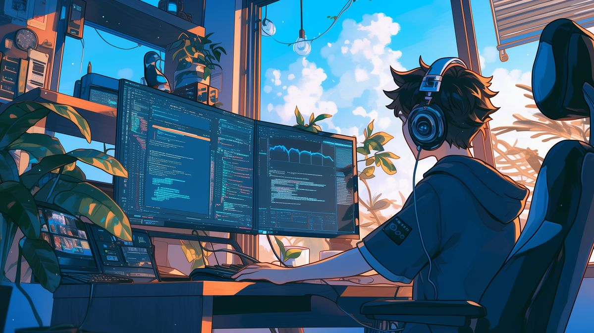

  

<table border="0" width="100%" cellpadding="0" cellspacing="0">
  <tr>
    <td width="65%" align="left" valign="middle">
      <h1 style="color: #58A6FF; font-family: sans-serif; font-weight: 600; margin-bottom: 10px; font-size: 30px;">Hi, I'm Fauzan Ahsanudin! 👋</h1>
      
      

        <strong>Data Science Undergraduate</strong> • <strong>Full Stack Enthusiast</strong>
         
        Passionate about building scalable ML pipelines and robust web applications. Currently bridging the gap between complex AI models and user-centric interfaces.
      

      

        
        
        
      

    </td>
    <td width="35%" align="center" valign="middle">
      
    </td>
  </tr>
</table>

 

## 🎯 **Current Focus**

- 🔬 Developing **Computer Vision** models for crowd density estimation  
- 🌐 Building **Full Stack** applications with modern frameworks (React & Node.js)
- 🧠 Deep diving into **PyTorch** and **Neural Network** optimization  
- 📊 Building end-to-end **ML pipelines** with **MLflow** and **Docker**

 

## 🛠️ **Tech Arsenal**

### **Languages & Core**

  
  
  
  
  

### **AI & Data Science**

  
  
  
  
  

### **Full Stack Development**

  
  
  
  
  

### **DevOps & Tools**

  
  
  
  

 

 

## 📈 **GitHub Analytics**

  

  

 

 

## 🌐 **Check my Portfolio**

  

  <i style="color: #8b949e;">"Data is the new oil. But like oil, data is useless unless refined."</i>
    
  
   
  

